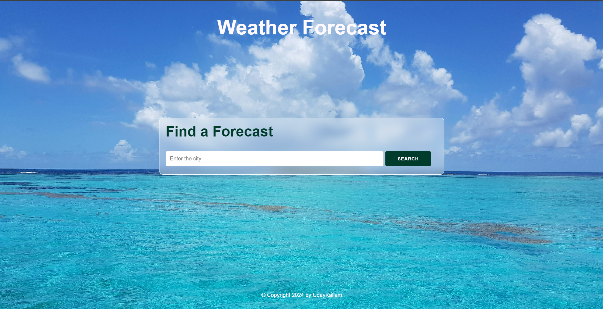
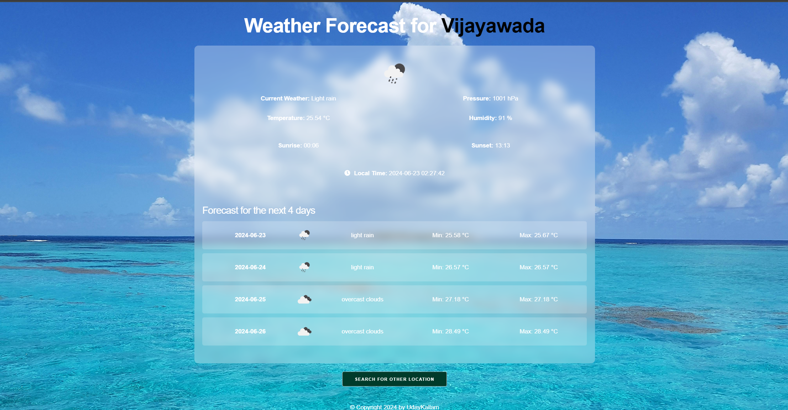

# WeatherApp

Welcome to the WeatherApp project! This simple application demonstrates how to work with APIs using Django. It serves as a great starting point for anyone looking to get familiar with Django and API integration. Python is one of the fastest-growing programming languages, and keeping up with its latest features is essential. This project aims to provide a basic understanding of how to use frameworks like Django.

## Getting Started

### Prerequisites

Make sure you have Python installed on your machine. You'll also need to install Django and other dependencies.

### Installation

1. **Clone the repository**:
    ```bash
    git clone <repository-url>
    ```

2. **Install the required packages**:
    - Using pip:
      ```bash
      pip install Django
      ```
    - Alternatively, you can install the packages via your IDE settings:
      - Go to **Settings** -> **Project: WeatherApp** -> **Python Interpreter**
      - Click on the `+` icon and add the package

3. **Navigate to the project directory**:
    ```bash
    cd weatherapp
    ```

4. **Add your API keys in `settings.py`**:
    Open the `weatherapp/settings.py` file and add your API keys:
    ```python
    # settings.py
    WEATHER_API_KEY = 'your_openweathermap_api_key_here'
    TIMEZONE_API_KEY = 'your_timezone_api_key'
    ```

5. **Run the project**:
    ```bash
    python manage.py runserver
    ```

### Usage

Once the server is running, open your browser and go to `http://127.0.0.1:8000` to view the application.

## Demo

### Home Page


### Forecast Page



---

Happy coding!
